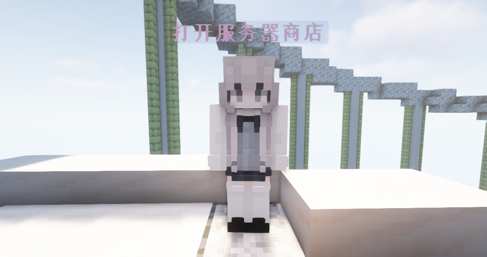
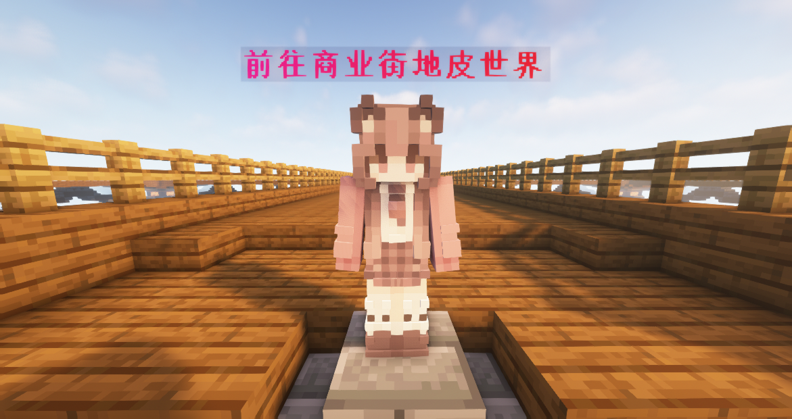

# ⚖️ 商店

> 服务器商店与玩家商店

## 服务器商店

服务器商店位于主城的正南侧，使用次元币来购买物品

使用命令 `/shop` 可以随时随地打开商店

使用命令 `/sellgui` 打开界面，物品放入其中，关闭界面自动售卖为次元币

### 物品种类

> **商店售卖的物品分为 8 类**

- 矿物买卖 _(可以在此商店售出矿物获得次元币)_
- 染色方块 _(羊毛，陶瓦等彩色物品)_
- 夜市 _(每小时刷新一次，随机售卖 6 件商品)_
- 光源方块 _(各种光源方块)_
- 建筑方块 _(常见的方块与方块变种)_
- 自然物品 _(植物与珊瑚类物品)_
- 工作方块 _(各种功能方块)_
- 红石商店 _(各种红石物品)_

### 商店反馈

- 如果商店的定价出现了问题 请及时反馈给 <u>管理组</u> 进行调整
- 每次反馈问题都可获得 <u>300 次元币</u> 奖励
- 利用 Bug 非法所得将会全部没收处理
- 情节严重者次元币归零

### 夜市

- 夜市每 6 小时进行一次刷新
- 每次刷新出 6 个物品
- 夜市所有物品只可购买不可售卖
- 夜市轮换池新增全套锻造模板
- 夜市轮换池新增全套纹样陶片
- 夜市轮换池新增全套唱片
- 夜市轮换池新增全套山羊角
- 夜市轮换池新增全套旗帜图案
- 夜市轮换池新增鞘翅、不死图腾、海洋之心、附魔金苹果和龙息

## 玩家商店 (商业街)

商业街位于地皮世界的商业街地皮世界，是由玩家商店组成的社区

在服务器商店找不到自己想要的物品？不妨来商业街看看！

### 商业街是做什么的？

商业街是让玩家可以使用 <u>箱子商店</u> 来进行自由贸易的地方

(谁还不想当个老板啦~ ovo)

### 怎么创建自己的店铺？

花费 500 次元币可以认领一块店铺地皮
