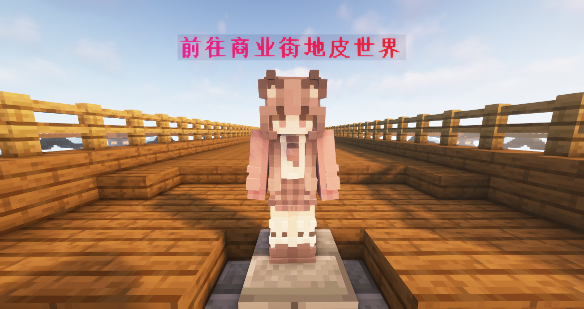

# ⚖️ 商店

> 在这里，每一件商品都有其独特的故事，每一次交易都是对您探险旅程的肯定

## 服务器商店

- 服务器商店位于主城的正南侧，使用次元币来购买物品

  

### 商店指令

- 使用命令 `/shop` 可以随时随地打开商店

- 使用命令 `/sellgui` 打开界面，将可售卖的物品放入其中，关闭界面自动售卖为次元币

### 商店分区

> 商店售卖的物品分为 **8** 类

- 矿物买卖* (可以在此商店售出矿物获得次元币)*
- 染色方块* (羊毛，陶瓦等彩色物品)*
- 夜市 _(每 6 小时刷新一次，随机售卖 6 件收藏品)_
- 光源方块 _(各种光源方块)_
- 建筑方块* (常见的方块与方块变种)*
- 自然物品 _(植物与珊瑚类物品)_
- 工作方块 _(各种功能方块)_
- 红石商店* (各种红石物品)*

### 商店反馈

- 参与商店的设计与定价，优质的想法可获得次元币奖励

- 如果商店的定价出现了问题，请及时反馈给 **管理员** 进行调整
- 利用 **Bug** 非法所得将会全部没收处理

## 玩家商店 (商业街)

> 在服务器商店找不到自己想要的物品？不妨来商业街看看！

- 商业街位于地皮世界的商业街地皮世界，是由玩家商店组成的社区

  

### 商业街是做什么的？怎么创建商店？

- 商业街是让玩家可以使用 **箱子商店** 来进行自由贸易的地方
- 手持想售卖的物品，对箱子左键后在聊天栏输入此商品的价格，定价完成后箱子商店就创建好啦
- 右键箱子商店即可打开商店控制面板
