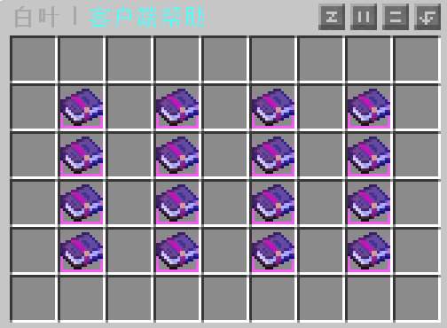
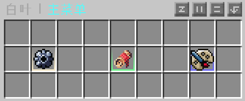

# 💡 实用小技巧

> 掌握这些小技巧，让您的游戏体验飞跃提升，探索之旅变得更加丰富多彩！

## 服务器客户端

> 使用群文件中的服务器客户端能使游戏体验翻倍哦

- 服务器客户端能够更改连锁采集的触发摁键，且内置许多辅助功能，详情请在客户端中摁下 `U` 查看

## 使用菜单

> 使用菜单能够让您在功能切换上畅通无阻

- 在游戏中摁下 `shift + F` 即可快速呼出菜单界面
- 若快捷键失效还可以使用命令 `/cd` 呼出菜单界面

## 休息一下吧

- 若您需要进入挂机状态，请使用命令`/afk`，在挂机状态时您不会受到伤害
- 使用命令`/sit`能够坐下，`/lay`能够躺下，`/crawl`能够趴下，`/spin`能够旋转
- 对着半砖或楼梯右键即可坐在上面

## 信息展示

### 展示物品

- 在聊天栏中输入 `[i]` 可以展示手中的物品
- 使用命令 `/hat` 可以将手中的物品佩戴在头上
- 直接将想佩戴的物品放置在头部装备栏也可进行佩戴，无需输入 `/hat` 命令

### 个人资料

- 使用命令 `/profile` 可以查看自己的个人档案
- 使用命令 `/profile <玩家名称>` 可以查看指定玩家的个人档案
- 准心对准其他玩家使用 `Shift + 右键` 可以查看此玩家个人档案

### 更换皮肤

- 使用命令 `/skin <玩家名>`，您可以更改您的角色皮肤为其他玩家的皮肤
- 您可以在网站 [皮肤网站](https://zh-cn.namemc.com/) 上查询您喜欢的皮肤，将使用这款皮肤的玩家的名称复制下来使用更换皮肤的指令
- 使用命令 `/skin clear` 可以清除当前的皮肤，显示您原本的皮肤

## 常用指令

| 指令        | 说明                                                                                        |
| ----------- | :------------------------------------------------------------------------------------------ |
| `/cd`       | 查看服务器菜单                                                                              |
| `/h`        | 快速回到主城                                                                                |
| `/home`     | 立即回到设置的家，这将会在设置出生点或使用 `/sethome` 时创建一个家                          |
| `/sethome`  | 您可以在安全的地方使用 `/sethome` 这会在您脚下的坐标生成一个家，之后可使用 `/home` 进行传送 |
| `/tpa`      | 您可以通过 `/tpa <玩家游戏名>` 快速传送至他人，但这需要他人的同意                           |
| `/dback`    | 您可以使用 `/dback` 返回到死亡地点                                                          |
| `//trash`   | 打开公共垃圾桶                                                                              |
| `/unload`   | 快速分配背包内物品至附近的箱子                                                              |
| `/profile`  | 您可以使用 `/profile` 快速查看玩家的个人资料，包括身上的装备和服务器金融内容等              |
| `/plt open` | 您可以使用 `/plt open` 打开服务器称号仓库                                                   |
| `/dt send`  | 您可以使用 `/dt send <玩家>` 来向一位玩家发出单挑请求                                       |
| `/eb l`     | 您可以使用 `/eb l` 来查看如何评选优秀建筑                                                   |
| `/shop`     | 您可以使用 `/shop` 来快速打开服务器商店                                                     |
