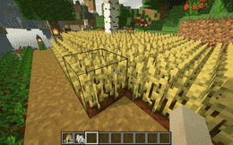
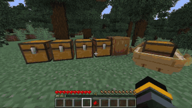
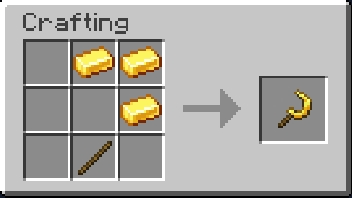
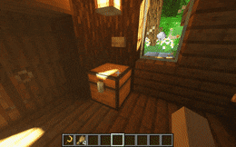
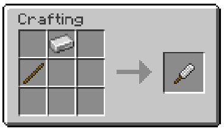
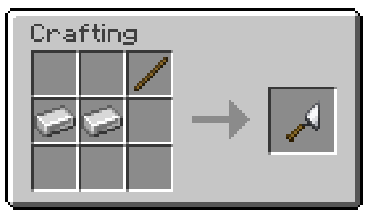
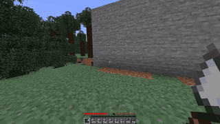

# 😊 更好的 Minecraft

> 让 Minecraft 变得更好吧！

## 双开门

两个并排的门现在将在您打开其中一侧时自动打开另一侧，因此两扇门同时打开和关闭，无论是否右键单击另一个。

## 更好的农业

右键**完全生长**的植物即可立即收获并重新种下种子。

## 🔍 查找物品

你有没有想过，你把末影珍珠放在哪里了，就像现在一样？别担心，物品查找器已经为您提供了保障。

使用命令 `/finditem minecraft:enderpearl` 在附近的所有容器中搜索给定的项目。（如果你的朋友偷了它就找不到力）

如果您的库存中已有相同类型的物品，您也可以只按住 **`Shift`** 并在打开的库存中右键单击它以执行对该项目类型的搜索。

## 更好的三叉戟

- 当三叉戟被附魔上忠诚时，如果玩家将其掉入虚空，三叉戟不会丢失
- 被附魔上穿刺的三叉戟会对所有接触水的生物造成更多伤害，而不仅仅是海洋生物
- 当玩家使用左手投掷三叉戟时，三叉戟也会被拾取回左手
- 被附魔上忠诚的三叉戟不会被传送门传送，以避免丢失

## 镰刀

当你有一大片耕地时，你可以制作镰刀来快速收取一大片的庄稼！金制镰刀是最好的镰刀，当然您也可以通过木材、石头制作镰刀

> 合成表

> 使用示例

## 一键箱子整理

当按下按钮时，按钮 1 个方块半径内的所有箱子都会自动完成整理。

## 物品合成

插件添加了相当多的物品以供合成，这里介绍一些常用的物品合成方式

### 锉子

### 抹刀

想要建造出随机纹理效果可以试试抹刀哦

> 合成表

> 使用示例

### 指北针

永远指向北方，材料成本低廉

### 相关链接

[插件官方网站](https://oddlama.github.io/vane/)
-->
